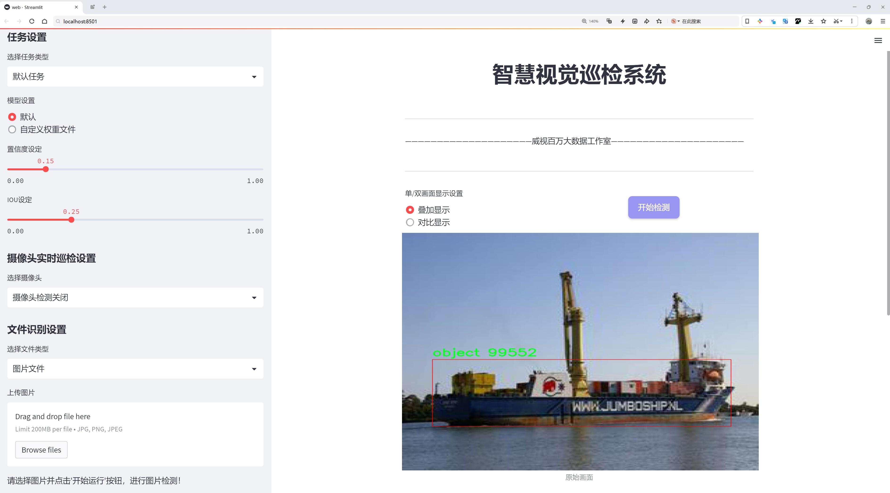

# 船舶类型检测系统源码分享
 # [一条龙教学YOLOV8标注好的数据集一键训练_70+全套改进创新点发刊_Web前端展示]

### 1.研究背景与意义

项目参考[AAAI Association for the Advancement of Artificial Intelligence](https://gitee.com/qunmasj/projects)

研究背景与意义

随着全球贸易的不断发展，海洋运输在国际物流中扮演着越来越重要的角色。船舶作为海洋运输的主要载体，其类型的准确识别与分类不仅对于航运管理、海洋安全、环境保护等领域具有重要意义，也为海洋资源的合理利用提供了科学依据。然而，传统的船舶类型检测方法往往依赖于人工观察和经验判断，效率低下且容易受到人为因素的影响，难以满足现代海洋运输的需求。因此，基于深度学习的自动化船舶类型检测系统应运而生，成为研究的热点。

在众多深度学习模型中，YOLO（You Only Look Once）系列因其高效的实时检测能力而受到广泛关注。YOLOv8作为该系列的最新版本，结合了更为先进的特征提取和目标检测技术，能够在复杂的海洋环境中实现高精度的船舶类型识别。然而，尽管YOLOv8在目标检测方面表现出色，但在特定领域如船舶类型检测时，仍然面临着一些挑战。例如，船舶的外观、尺寸、颜色等多样性使得模型在不同类别之间的区分变得更加困难。此外，现有的数据集往往不足以覆盖所有船舶类型，导致模型的泛化能力受到限制。

为了解决上述问题，本研究旨在基于改进的YOLOv8模型，构建一个高效的船舶类型检测系统。我们将利用VAIS_RGB+SMD+MARITIME+WSODD+MARVEL数据集，该数据集包含24648张图像，涵盖54个船舶类别。这一丰富的数据资源为模型的训练和验证提供了坚实的基础。通过对数据集的深入分析，我们可以识别出不同船舶类型的特征，从而为模型的改进提供数据支持。

本研究的意义不仅在于提升船舶类型检测的准确性和效率，更在于推动海洋智能监测技术的发展。通过引入改进的YOLOv8模型，我们希望能够实现对船舶类型的快速、准确识别，从而为海洋安全监测、环境保护及资源管理提供有力支持。此外，该系统的成功应用将为其他领域的目标检测提供借鉴，推动深度学习技术在更广泛的应用场景中的发展。

综上所述，基于改进YOLOv8的船舶类型检测系统的研究，不仅具有重要的理论价值，更具备广泛的实际应用前景。通过提升船舶类型检测的智能化水平，我们将为海洋运输的安全与效率提供新的解决方案，助力海洋经济的可持续发展。

### 2.图片演示




##### 注意：由于此博客编辑较早，上面“2.图片演示”和“3.视频演示”展示的系统图片或者视频可能为老版本，新版本在老版本的基础上升级如下：（实际效果以升级的新版本为准）

  （1）适配了YOLOV8的“目标检测”模型和“实例分割”模型，通过加载相应的权重（.pt）文件即可自适应加载模型。

  （2）支持“图片识别”、“视频识别”、“摄像头实时识别”三种识别模式。

  （3）支持“图片识别”、“视频识别”、“摄像头实时识别”三种识别结果保存导出，解决手动导出（容易卡顿出现爆内存）存在的问题，识别完自动保存结果并导出到。

  （4）支持Web前端系统中的标题、背景图等自定义修改，后面提供修改教程。

  另外本项目提供训练的数据集和训练教程,暂不提供权重文件（best.pt）,需要您按照教程进行训练后实现图片演示和Web前端界面演示的效果。

### 3.视频演示

[3.1 视频演示](https://www.bilibili.com/video/BV1odWQefEqt/?spm_id_from=333.999.0.0&vd_source=bc9aec86d164b67a7004b996143742dc)

### 4.数据集信息展示

数据集信息展示

本数据集名为VAIS_RGB+SMD+MARITIME+WSODD+MARVEL，专为改进YOLOv8的船舶类型检测系统而设计，旨在提升模型在复杂海洋环境中对多种船舶类型的识别能力。该数据集包含24648张高质量图像，涵盖54个不同的类别，能够为模型训练提供丰富的样本和多样化的场景。这些图像不仅展示了各种船舶的外观特征，还包含了其他海洋物体，如浮标和其他相关物品，从而为检测系统提供了更为全面的训练基础。

在类别方面，数据集中的54个类别涵盖了从普通船只到特定类型船舶的广泛范围，具体类别包括但不限于：船（boat）、浮标（buoy）、物体（object）和船舶（ship）。这些类别的多样性使得模型能够学习到不同船舶在不同环境下的特征，增强其在实际应用中的泛化能力。每个类别都经过精心标注，确保训练过程中模型能够准确识别和分类。

数据集的图像数量达到24648张，这一庞大的数据量为模型提供了充足的训练样本，有助于提升其检测精度和鲁棒性。通过对大量样本的学习，YOLOv8模型能够更好地适应不同的海洋环境和复杂的背景，从而提高在实际应用中的表现。此外，数据集中的图像多样性也为模型提供了丰富的场景变化，帮助其在各种条件下保持高效的检测能力。

数据集的获取遵循CC BY 4.0许可证，用户可以在遵循相应使用条款的前提下自由使用和分享该数据集。这一开放的许可证不仅促进了学术界和工业界的合作与交流，也为研究人员提供了便利，使他们能够在船舶检测领域进行更深入的研究和探索。

通过利用VAIS_RGB+SMD+MARITIME+WSODD+MARVEL数据集，研究人员和开发者能够在YOLOv8模型的基础上，进行更为细致的船舶类型检测研究。这一数据集的设计考虑到了实际应用中的多样性和复杂性，为模型的训练提供了坚实的基础。未来，随着技术的不断进步和数据集的不断扩展，船舶类型检测系统的性能将会得到进一步提升，为海洋监测、航运安全等领域带来更多的可能性和应用价值。


### 5.全套项目环境部署视频教程（零基础手把手教学）

[5.1 环境部署教程链接（零基础手把手教学）](https://www.ixigua.com/7404473917358506534?logTag=c807d0cbc21c0ef59de5)


[5.2 安装Python虚拟环境创建和依赖库安装视频教程链接（零基础手把手教学）](https://www.ixigua.com/7404474678003106304?logTag=1f1041108cd1f708b01a)

### 6.手把手YOLOV8训练视频教程（零基础小白有手就能学会）

[6.1 环境部署教程链接（零基础手把手教学）](https://www.ixigua.com/7404477157818401292?logTag=d31a2dfd1983c9668658)

### 7.70+种全套YOLOV8创新点代码加载调参视频教程（一键加载写好的改进模型的配置文件）

[7.1 环境部署教程链接（零基础手把手教学）](https://www.ixigua.com/7404478314661806627?logTag=29066f8288e3f4eea3a4)

### 8.70+种全套YOLOV8创新点原理讲解（非科班也可以轻松写刊发刊，V10版本正在科研待更新）

由于篇幅限制，每个创新点的具体原理讲解就不一一展开，具体见下列网址中的创新点对应子项目的技术原理博客网址【Blog】：


[8.1 70+种全套YOLOV8创新点原理讲解链接](https://gitee.com/qunmasj/good)

### 9.系统功能展示（检测对象为举例，实际内容以本项目数据集为准）

图1.系统支持检测结果表格显示

  图2.系统支持置信度和IOU阈值手动调节

  图3.系统支持自定义加载权重文件best.pt(需要你通过步骤5中训练获得)

  图4.系统支持摄像头实时识别

  图5.系统支持图片识别

  图6.系统支持视频识别

  图7.系统支持识别结果文件自动保存

  图8.系统支持Excel导出检测结果数据


### 10.原始YOLOV8算法原理

原始YOLOv8算法原理

YOLOv8（You Only Look Once version 8）作为YOLO系列的最新版本，标志着目标检测领域的一次重要进步。该算法在前几代YOLO模型的基础上进行了多项改进，旨在提高检测精度和速度，同时保持模型的轻量化特性。YOLOv8的架构由输入层、Backbone、Neck和Head四个主要部分组成，形成了一个高效的目标检测流程。

在输入层，YOLOv8首先对输入图像进行预处理，包括调整图像比例和应用Mosaic数据增强技术。Mosaic增强能够将多张图像拼接成一张新图像，从而提高模型的鲁棒性和泛化能力。然而，YOLOv8在训练的最后阶段停止使用Mosaic增强，以避免对数据真实分布的破坏，确保模型学习到有效的信息。

Backbone部分是YOLOv8的特征提取模块，采用了CSPDarknet结构。与前代模型相比，YOLOv8用C2f模块替换了C3模块。C2f模块的设计理念是将输入特征图分为两个分支，每个分支经过卷积层进行降维处理。通过这种方式，C2f模块能够更好地捕捉到丰富的梯度流信息，并且在模型的轻量化方面表现出色。此外，YOLOv8引入了v8_C2fBottleneck层，进一步提升了特征图的维度和信息流动性。SPPF（快速空间金字塔池化）模块的使用，增强了对不同尺度特征的提取能力，同时减少了计算量和参数量，使得特征提取过程更加高效。

在Neck部分，YOLOv8采用了特征金字塔网络（FPN）与路径聚合网络（PAN）的结合，形成了双塔结构。这一结构能够有效地促进语义特征与定位特征的融合，从而增强模型对不同尺度目标的检测能力。通过多层卷积和池化操作，Neck部分将特征图进行处理和压缩，为后续的目标检测提供了丰富的特征信息。

YOLOv8的Head部分则是模型的检测模块，采用了解耦头的结构。与传统的检测头不同，YOLOv8将回归分支和预测分支分开，使得分类和定位任务可以独立优化。这样的设计使得模型在处理复杂场景时，能够更快地收敛，并提高预测的精度。此外，YOLOv8引入了无锚框（Anchor-Free）检测方式，直接预测目标的中心点和宽高比例，减少了对Anchor框的依赖，从而提升了检测速度和准确度。

在任务对齐学习（TAL）方面，YOLOv8引入了分类分数和IOU的高次幂乘积作为衡量任务对齐程度的指标。这一创新使得模型在进行分类和定位时，能够更好地平衡两者之间的关系，确保在提高定位精度的同时，保持分类的准确性。通过这种方式，YOLOv8在检测结果上取得了显著的提升，尤其是在复杂场景下的表现。

YOLOv8在性能上也取得了令人瞩目的成果。在COCO数据集上的测试表明，YOLOv8在同尺寸模型中，参数量并未显著增加的情况下，检测精度却优于其他YOLO系列模型。同时，YOLOv8的推理速度也得到了优化，确保了在实时应用中的可行性。这使得YOLOv8在需要兼顾实时性和准确性的任务中，展现出极大的应用潜力。

总的来说，YOLOv8通过一系列创新和改进，进一步巩固了其在目标检测领域的领先地位。其高效的特征提取、灵活的网络结构和精确的检测能力，使得YOLOv8不仅适用于学术研究，也在实际应用中展现出广泛的价值。随着对YOLOv8的深入研究和应用开发，未来在自动驾驶、智能监控、机器人视觉等领域，YOLOv8无疑将发挥更为重要的作用。


### 11.项目核心源码讲解（再也不用担心看不懂代码逻辑）

#### 11.1 ultralytics\models\rtdetr\predict.py

以下是经过精简和注释的核心代码部分：

```python
import torch
from ultralytics.data.augment import LetterBox
from ultralytics.engine.predictor import BasePredictor
from ultralytics.engine.results import Results
from ultralytics.utils import ops

class RTDETRPredictor(BasePredictor):
    """
    RT-DETR (Real-Time Detection Transformer) 预测器，继承自 BasePredictor 类，用于使用百度的 RT-DETR 模型进行预测。
    """

    def postprocess(self, preds, img, orig_imgs):
        """
        对模型的原始预测结果进行后处理，生成边界框和置信度分数。

        Args:
            preds (torch.Tensor): 模型的原始预测结果。
            img (torch.Tensor): 处理后的输入图像。
            orig_imgs (list or torch.Tensor): 原始未处理的图像。

        Returns:
            (list[Results]): 包含后处理后的边界框、置信度分数和类别标签的 Results 对象列表。
        """
        # 获取预测结果的维度
        nd = preds[0].shape[-1]
        # 分离边界框和分数
        bboxes, scores = preds[0].split((4, nd - 4), dim=-1)

        # 如果输入图像是张量，则转换为 numpy 数组
        if not isinstance(orig_imgs, list):
            orig_imgs = ops.convert_torch2numpy_batch(orig_imgs)

        results = []
        for i, bbox in enumerate(bboxes):  # 遍历每个边界框
            bbox = ops.xywh2xyxy(bbox)  # 将边界框格式从 (x, y, w, h) 转换为 (x1, y1, x2, y2)
            score, cls = scores[i].max(-1, keepdim=True)  # 获取每个边界框的最大分数和对应的类别
            idx = score.squeeze(-1) > self.args.conf  # 根据置信度阈值过滤

            # 如果指定了类别，则进一步过滤
            if self.args.classes is not None:
                idx = (cls == torch.tensor(self.args.classes, device=cls.device)).any(1) & idx
            
            # 过滤后的预测结果
            pred = torch.cat([bbox, score, cls], dim=-1)[idx]
            orig_img = orig_imgs[i]  # 获取原始图像
            oh, ow = orig_img.shape[:2]  # 获取原始图像的高度和宽度
            
            # 将边界框坐标从归一化格式转换为原始图像尺寸
            pred[..., [0, 2]] *= ow
            pred[..., [1, 3]] *= oh
            
            # 获取图像路径并保存结果
            img_path = self.batch[0][i]
            results.append(Results(orig_img, path=img_path, names=self.model.names, boxes=pred))
        
        return results

    def pre_transform(self, im):
        """
        在将输入图像送入模型进行推理之前，对其进行预处理。输入图像被调整为方形比例并填充。

        Args:
            im (list[np.ndarray] | torch.Tensor): 输入图像，形状为 (N,3,h,w) 的张量，或 [(h,w,3) x N] 的列表。

        Returns:
            (list): 预处理后的图像列表，准备进行模型推理。
        """
        letterbox = LetterBox(self.imgsz, auto=False, scaleFill=True)  # 创建 LetterBox 对象
        return [letterbox(image=x) for x in im]  # 对每个图像进行 LetterBox 处理
```

### 代码核心部分分析
1. **类定义**：`RTDETRPredictor` 继承自 `BasePredictor`，用于实现 RT-DETR 模型的预测功能。
2. **后处理方法 `postprocess`**：
   - 该方法接收模型的原始预测结果，进行边界框和置信度的提取与过滤。
   - 通过置信度阈值和类别过滤，得到最终的预测结果。
   - 将预测的边界框坐标转换为原始图像的尺寸，并返回包含预测结果的 `Results` 对象列表。
3. **预处理方法 `pre_transform`**：
   - 该方法用于对输入图像进行预处理，确保输入图像的尺寸为方形并进行适当的填充。
   - 使用 `LetterBox` 进行图像调整，返回处理后的图像列表。

以上代码的核心功能是实现实时目标检测的预测和后处理，确保输入输出的格式符合模型要求。

该文件定义了一个名为 `RTDETRPredictor` 的类，它是基于 `BasePredictor` 类的扩展，专门用于使用百度的 RT-DETR 模型进行实时目标检测。RT-DETR 模型结合了视觉变换器的优势，能够在保持高精度的同时实现实时目标检测。该类支持高效的混合编码和 IoU（Intersection over Union）感知查询选择等关键特性。

在文件的开头，导入了一些必要的模块，包括 PyTorch 以及一些来自 Ultralytics 库的功能模块，如数据增强、预测器基类、结果处理和操作工具。

`RTDETRPredictor` 类中包含两个主要的方法：`postprocess` 和 `pre_transform`。

`postprocess` 方法用于对模型的原始预测结果进行后处理，以生成边界框和置信度分数。该方法首先从模型的预测结果中分离出边界框和分数，然后根据置信度和指定的类别进行过滤。处理后的结果包括边界框、置信度和类别标签，并将这些信息封装在 `Results` 对象中返回。

`pre_transform` 方法则用于在将输入图像送入模型进行推理之前进行预处理。该方法使用 `LetterBox` 类将输入图像调整为方形，并确保图像填充以适应模型的输入要求。最终返回的是经过预处理的图像列表，准备好供模型进行推理。

整体来看，这个文件的功能是为 RT-DETR 模型提供一个预测器，使其能够高效地处理输入图像并生成目标检测的结果。通过后处理和预处理步骤，确保了模型的输入输出符合预期，从而实现高效的实时目标检测。

#### 11.2 ultralytics\models\yolo\classify\__init__.py

以下是代码中最核心的部分，并附上详细的中文注释：

```python
# 导入Ultralytics YOLO库中的分类预测、训练和验证模块
from ultralytics.models.yolo.classify.predict import ClassificationPredictor  # 导入分类预测器
from ultralytics.models.yolo.classify.train import ClassificationTrainer      # 导入分类训练器
from ultralytics.models.yolo.classify.val import ClassificationValidator      # 导入分类验证器

# 定义模块的公开接口，指定可以被外部访问的类
__all__ = "ClassificationPredictor", "ClassificationTrainer", "ClassificationValidator"
```

### 注释说明：
1. **导入模块**：
   - `ClassificationPredictor`：用于进行分类预测的类，能够根据输入的数据进行分类。
   - `ClassificationTrainer`：用于训练分类模型的类，负责模型的训练过程。
   - `ClassificationValidator`：用于验证分类模型性能的类，通常在训练后使用以评估模型的准确性。

2. **`__all__` 变量**：
   - 该变量定义了模块的公共接口，指定了在使用 `from module import *` 时可以导入的类。这有助于控制模块的可见性和避免命名冲突。

这个程序文件是Ultralytics YOLO模型中的一个初始化文件，位于`ultralytics/models/yolo/classify`目录下。文件的主要功能是导入与分类相关的模块，并定义了可供外部访问的接口。

首先，文件顶部的注释部分标明了该项目的名称“Ultralytics YOLO”以及其使用的许可证类型（AGPL-3.0）。这表明该项目是一个开源项目，遵循特定的开源许可证。

接下来，文件通过`from`语句导入了三个类：`ClassificationPredictor`、`ClassificationTrainer`和`ClassificationValidator`。这些类分别负责分类任务中的预测、训练和验证功能。具体来说：

- `ClassificationPredictor`：这个类用于进行分类预测，可能包含加载模型、处理输入数据以及输出预测结果的功能。
- `ClassificationTrainer`：这个类负责模型的训练过程，包括数据加载、模型训练、损失计算等。
- `ClassificationValidator`：这个类用于验证模型的性能，通常在训练完成后使用，以评估模型在验证集上的表现。

最后，`__all__`变量定义了一个字符串元组，列出了可以被外部模块导入的类名。这意味着当其他模块使用`from ultralytics.models.yolo.classify import *`时，只会导入这三个类，而不会导入该模块中的其他内容。这种做法有助于控制模块的公共接口，避免不必要的命名冲突。

总的来说，这个初始化文件的作用是组织和简化分类模块的接口，使得用户可以方便地使用分类相关的功能。

#### 11.3 ui.py

```python
import sys
import subprocess

def run_script(script_path):
    """
    使用当前 Python 环境运行指定的脚本。

    Args:
        script_path (str): 要运行的脚本路径

    Returns:
        None
    """
    # 获取当前 Python 解释器的路径
    python_path = sys.executable

    # 构建运行命令
    command = f'"{python_path}" -m streamlit run "{script_path}"'

    # 执行命令
    result = subprocess.run(command, shell=True)
    if result.returncode != 0:
        print("脚本运行出错。")


# 实例化并运行应用
if __name__ == "__main__":
    # 指定您的脚本路径
    script_path = "web.py"  # 这里可以直接指定脚本路径

    # 运行脚本
    run_script(script_path)
```

### 代码注释说明：

1. **导入模块**：
   - `import sys`：导入系统相关的模块，用于获取当前 Python 解释器的路径。
   - `import subprocess`：导入子进程模块，用于在 Python 中执行外部命令。

2. **定义函数 `run_script`**：
   - 该函数接受一个参数 `script_path`，表示要运行的 Python 脚本的路径。
   - 函数内部首先获取当前 Python 解释器的路径，存储在 `python_path` 变量中。
   - 然后构建一个命令字符串 `command`，用于运行指定的脚本。这里使用了 `streamlit` 模块来运行 web 应用。
   - 使用 `subprocess.run` 执行构建的命令。如果命令执行失败（返回码不为 0），则打印错误信息。

3. **主程序入口**：
   - `if __name__ == "__main__":` 这行代码确保只有在直接运行该脚本时，以下代码才会被执行。
   - `script_path` 变量指定了要运行的脚本文件名（在此例中为 `web.py`）。
   - 最后调用 `run_script(script_path)` 来执行指定的脚本。

这个程序文件名为 `ui.py`，主要功能是使用当前的 Python 环境来运行一个指定的脚本。代码首先导入了必要的模块，包括 `sys`、`os` 和 `subprocess`，以及一个自定义的路径处理模块 `abs_path`。

在 `run_script` 函数中，首先获取当前 Python 解释器的路径，存储在 `python_path` 变量中。接着，构建一个命令字符串，该命令使用 `streamlit` 模块来运行指定的脚本，脚本路径由参数 `script_path` 提供。然后，使用 `subprocess.run` 方法执行这个命令，`shell=True` 允许在 shell 中执行命令。

如果脚本运行过程中出现错误，返回码不为零，程序会打印出“脚本运行出错”的提示信息。

在文件的最后部分，使用 `if __name__ == "__main__":` 来确保当该文件作为主程序运行时才会执行后面的代码。这里指定了要运行的脚本路径为 `web.py`，并调用 `run_script` 函数来执行这个脚本。

整体来看，这个程序的主要作用是为用户提供一个简便的方式来运行一个名为 `web.py` 的脚本，确保在当前的 Python 环境中执行，并处理可能出现的错误。

#### 11.4 ultralytics\utils\callbacks\tensorboard.py

以下是代码中最核心的部分，并附上详细的中文注释：

```python
# 导入必要的库和模块
from ultralytics.utils import LOGGER, SETTINGS, TESTS_RUNNING, colorstr

try:
    # 尝试导入TensorBoard的SummaryWriter
    from torch.utils.tensorboard import SummaryWriter

    # 确保当前不是在测试运行中
    assert not TESTS_RUNNING  
    # 确保TensorBoard集成已启用
    assert SETTINGS["tensorboard"] is True  
    WRITER = None  # 初始化TensorBoard的SummaryWriter实例

except (ImportError, AssertionError, TypeError, AttributeError):
    # 处理导入错误和断言错误
    SummaryWriter = None  # 如果导入失败，则将SummaryWriter设置为None

def _log_scalars(scalars, step=0):
    """将标量值记录到TensorBoard中。"""
    if WRITER:  # 如果WRITER存在
        for k, v in scalars.items():  # 遍历标量字典
            WRITER.add_scalar(k, v, step)  # 记录每个标量值

def _log_tensorboard_graph(trainer):
    """将模型图记录到TensorBoard中。"""
    try:
        import warnings
        from ultralytics.utils.torch_utils import de_parallel, torch

        imgsz = trainer.args.imgsz  # 获取输入图像大小
        imgsz = (imgsz, imgsz) if isinstance(imgsz, int) else imgsz  # 确保图像大小是一个元组
        p = next(trainer.model.parameters())  # 获取模型参数以确定设备和类型
        im = torch.zeros((1, 3, *imgsz), device=p.device, dtype=p.dtype)  # 创建一个输入图像（必须是零而不是空）

        with warnings.catch_warnings():
            warnings.simplefilter("ignore", category=UserWarning)  # 忽略JIT跟踪警告
            WRITER.add_graph(torch.jit.trace(de_parallel(trainer.model), im, strict=False), [])  # 记录模型图
    except Exception as e:
        LOGGER.warning(f"WARNING ⚠️ TensorBoard图形可视化失败 {e}")  # 记录警告信息

def on_pretrain_routine_start(trainer):
    """初始化TensorBoard记录，使用SummaryWriter。"""
    if SummaryWriter:  # 如果SummaryWriter存在
        try:
            global WRITER
            WRITER = SummaryWriter(str(trainer.save_dir))  # 创建SummaryWriter实例
            prefix = colorstr("TensorBoard: ")
            LOGGER.info(f"{prefix}使用 'tensorboard --logdir {trainer.save_dir}' 启动，查看地址为 http://localhost:6006/")
        except Exception as e:
            LOGGER.warning(f"WARNING ⚠️ TensorBoard未正确初始化，未记录此运行。 {e}")  # 记录警告信息

def on_train_start(trainer):
    """记录TensorBoard图形。"""
    if WRITER:  # 如果WRITER存在
        _log_tensorboard_graph(trainer)  # 记录模型图

def on_train_epoch_end(trainer):
    """在训练周期结束时记录标量统计信息。"""
    _log_scalars(trainer.label_loss_items(trainer.tloss, prefix="train"), trainer.epoch + 1)  # 记录训练损失
    _log_scalars(trainer.lr, trainer.epoch + 1)  # 记录学习率

def on_fit_epoch_end(trainer):
    """在训练周期结束时记录周期指标。"""
    _log_scalars(trainer.metrics, trainer.epoch + 1)  # 记录训练指标

# 定义回调函数字典
callbacks = (
    {
        "on_pretrain_routine_start": on_pretrain_routine_start,
        "on_train_start": on_train_start,
        "on_fit_epoch_end": on_fit_epoch_end,
        "on_train_epoch_end": on_train_epoch_end,
    }
    if SummaryWriter  # 如果SummaryWriter存在
    else {}
)
```

### 代码核心部分说明：
1. **TensorBoard集成**：通过`SummaryWriter`实现与TensorBoard的集成，用于记录训练过程中的各种标量和模型图。
2. **日志记录函数**：定义了多个函数用于记录标量（如损失和学习率）和模型图到TensorBoard。
3. **回调机制**：通过回调函数在训练的不同阶段（如开始训练、结束训练周期等）进行日志记录。

这个程序文件是一个用于集成TensorBoard的回调模块，主要用于在训练过程中记录和可视化模型的训练状态和性能指标。文件的核心功能是通过TensorBoard记录标量值和模型图，以便于后续的分析和调试。

首先，文件导入了一些必要的模块，包括日志记录器（LOGGER）、设置（SETTINGS）和颜色字符串工具（colorstr）。接着，尝试导入`torch.utils.tensorboard`中的`SummaryWriter`，这是TensorBoard的核心类，用于记录数据。如果导入失败，或者在测试环境中运行，或者TensorBoard集成未启用，程序会捕获异常并将`SummaryWriter`设置为`None`。

在`_log_scalars`函数中，程序定义了如何将标量值记录到TensorBoard。它接受一个字典类型的`scalars`和一个步数`step`，如果`WRITER`实例存在，则遍历字典中的每个键值对，并使用`add_scalar`方法将其记录到TensorBoard。

`_log_tensorboard_graph`函数用于将模型图记录到TensorBoard。它首先获取输入图像的尺寸，并创建一个全零的输入张量。然后使用`torch.jit.trace`对模型进行跟踪，并将生成的图添加到TensorBoard中。如果在此过程中发生任何异常，程序会记录警告信息。

在`on_pretrain_routine_start`函数中，程序初始化TensorBoard的记录功能。它会创建一个`SummaryWriter`实例，并指定日志保存目录。如果初始化成功，程序会输出一条信息，提示用户如何启动TensorBoard并查看日志。

`on_train_start`函数在训练开始时调用，负责记录模型图。`on_train_epoch_end`和`on_fit_epoch_end`函数分别在训练周期结束时记录训练损失和学习率，以及训练指标。

最后，文件定义了一个`callbacks`字典，其中包含了各个回调函数的映射，只有在`SummaryWriter`可用的情况下才会包含这些回调。这使得在训练过程中可以根据不同的事件自动调用相应的记录函数，从而实现对训练过程的全面监控和分析。

#### 11.5 ultralytics\engine\tuner.py

以下是代码中最核心的部分，并附上详细的中文注释：

```python
class Tuner:
    """
    负责YOLO模型超参数调优的类。

    该类通过在给定的迭代次数内对YOLO模型的超参数进行变异，评估其性能并进行优化。

    属性:
        space (dict): 超参数搜索空间，包含变异的边界和缩放因子。
        tune_dir (Path): 保存进化日志和结果的目录。
        tune_csv (Path): 保存进化日志的CSV文件路径。

    方法:
        _mutate(hyp: dict) -> dict:
            在`self.space`指定的边界内变异给定的超参数。

        __call__():
            执行多次迭代的超参数进化过程。
    """

    def __init__(self, args=DEFAULT_CFG, _callbacks=None):
        """
        使用配置初始化Tuner。

        参数:
            args (dict, optional): 超参数进化的配置。
        """
        # 设置超参数搜索空间，包含每个超参数的最小值、最大值和可选的增益
        self.space = args.pop("space", None) or {
            "lr0": (1e-5, 1e-1),  # 初始学习率
            "lrf": (0.0001, 0.1),  # 最终学习率
            "momentum": (0.7, 0.98, 0.3),  # 动量
            "weight_decay": (0.0, 0.001),  # 权重衰减
            # 其他超参数...
        }
        self.args = get_cfg(overrides=args)  # 获取配置
        self.tune_dir = get_save_dir(self.args, name="tune")  # 获取保存目录
        self.tune_csv = self.tune_dir / "tune_results.csv"  # CSV文件路径
        self.callbacks = _callbacks or callbacks.get_default_callbacks()  # 获取回调函数
        callbacks.add_integration_callbacks(self)  # 添加集成回调
        LOGGER.info(f"Initialized Tuner instance with 'tune_dir={self.tune_dir}'")

    def _mutate(self, parent="single", n=5, mutation=0.8, sigma=0.2):
        """
        根据`self.space`中指定的边界和缩放因子变异超参数。

        参数:
            parent (str): 父代选择方法：'single'或'weighted'。
            n (int): 考虑的父代数量。
            mutation (float): 在给定迭代中参数变异的概率。
            sigma (float): 高斯随机数生成器的标准差。

        返回:
            (dict): 包含变异超参数的字典。
        """
        if self.tune_csv.exists():  # 如果CSV文件存在，选择最佳超参数进行变异
            # 选择父代
            x = np.loadtxt(self.tune_csv, ndmin=2, delimiter=",", skiprows=1)
            fitness = x[:, 0]  # 第一列为适应度
            n = min(n, len(x))  # 考虑的结果数量
            x = x[np.argsort(-fitness)][:n]  # 选择适应度最高的n个
            w = x[:, 0] - x[:, 0].min() + 1e-6  # 权重

            # 根据选择方法选择父代
            if parent == "single" or len(x) == 1:
                x = x[random.choices(range(n), weights=w)[0]]  # 加权选择
            elif parent == "weighted":
                x = (x * w.reshape(n, 1)).sum(0) / w.sum()  # 加权组合

            # 变异
            r = np.random  # 随机数生成器
            r.seed(int(time.time()))  # 设置随机种子
            g = np.array([v[2] if len(v) == 3 else 1.0 for k, v in self.space.items()])  # 获取增益
            ng = len(self.space)  # 超参数数量
            v = np.ones(ng)
            while all(v == 1):  # 确保有变异发生
                v = (g * (r.random(ng) < mutation) * r.randn(ng) * r.random() * sigma + 1).clip(0.3, 3.0)
            hyp = {k: float(x[i + 1] * v[i]) for i, k in enumerate(self.space.keys())}
        else:
            hyp = {k: getattr(self.args, k) for k in self.space.keys()}  # 初始化超参数

        # 限制在边界内
        for k, v in self.space.items():
            hyp[k] = max(hyp[k], v[0])  # 下限
            hyp[k] = min(hyp[k], v[1])  # 上限
            hyp[k] = round(hyp[k], 5)  # 保留五位有效数字

        return hyp

    def __call__(self, model=None, iterations=10, cleanup=True):
        """
        当调用Tuner实例时执行超参数进化过程。

        参数:
           model (Model): 预初始化的YOLO模型。
           iterations (int): 进化的代数。
           cleanup (bool): 是否删除迭代权重以减少存储空间。

        注意:
           该方法利用`self.tune_csv`路径对象读取和记录超参数及适应度分数。
        """
        t0 = time.time()  # 记录开始时间
        best_save_dir, best_metrics = None, None  # 初始化最佳保存目录和指标
        (self.tune_dir / "weights").mkdir(parents=True, exist_ok=True)  # 创建权重保存目录

        for i in range(iterations):
            # 变异超参数
            mutated_hyp = self._mutate()
            LOGGER.info(f"Starting iteration {i + 1}/{iterations} with hyperparameters: {mutated_hyp}")

            metrics = {}
            train_args = {**vars(self.args), **mutated_hyp}  # 合并超参数
            save_dir = get_save_dir(get_cfg(train_args))  # 获取保存目录
            weights_dir = save_dir / "weights"  # 权重目录
            ckpt_file = weights_dir / ("best.pt" if (weights_dir / "best.pt").exists() else "last.pt")  # 检查最佳权重文件

            try:
                # 使用变异后的超参数训练YOLO模型
                cmd = ["yolo", "train", *(f"{k}={v}" for k, v in train_args.items())]
                return_code = subprocess.run(cmd, check=True).returncode  # 运行训练命令
                metrics = torch.load(ckpt_file)["train_metrics"]  # 加载训练指标
                assert return_code == 0, "training failed"  # 检查训练是否成功

            except Exception as e:
                LOGGER.warning(f"WARNING ❌️ training failure for hyperparameter tuning iteration {i + 1}\n{e}")

            # 保存结果和变异超参数到CSV
            fitness = metrics.get("fitness", 0.0)  # 获取适应度
            log_row = [round(fitness, 5)] + [mutated_hyp[k] for k in self.space.keys()]  # 记录日志
            headers = "" if self.tune_csv.exists() else (",".join(["fitness"] + list(self.space.keys())) + "\n")
            with open(self.tune_csv, "a") as f:
                f.write(headers + ",".join(map(str, log_row)) + "\n")  # 写入CSV文件

            # 获取最佳结果
            x = np.loadtxt(self.tune_csv, ndmin=2, delimiter=",", skiprows=1)
            fitness = x[:, 0]  # 第一列为适应度
            best_idx = fitness.argmax()  # 获取最佳适应度索引
            best_is_current = best_idx == i  # 检查当前是否为最佳

            if best_is_current:
                best_save_dir = save_dir  # 更新最佳保存目录
                best_metrics = {k: round(v, 5) for k, v in metrics.items()}  # 更新最佳指标
                for ckpt in weights_dir.glob("*.pt"):
                    shutil.copy2(ckpt, self.tune_dir / "weights")  # 复制最佳权重到保存目录
            elif cleanup:
                shutil.rmtree(ckpt_file.parent)  # 删除迭代权重以减少存储空间

            # 绘制调优结果
            plot_tune_results(self.tune_csv)

            # 保存和打印调优结果
            header = (
                f'Iterations complete ✅ ({time.time() - t0:.2f}s)\n'
                f'Results saved to {self.tune_dir}\n'
                f'Best fitness={fitness[best_idx]} observed at iteration {best_idx + 1}\n'
                f'Best fitness metrics are {best_metrics}\n'
                f'Best fitness model is {best_save_dir}\n'
                f'Best fitness hyperparameters are printed below.\n'
            )
            LOGGER.info("\n" + header)
            data = {k: float(x[best_idx, i + 1]) for i, k in enumerate(self.space.keys())}
            yaml_save(
                self.tune_dir / "best_hyperparameters.yaml",
                data=data,
                header=remove_colorstr(header.replace(self.prefix, "# ")) + "\n",
            )
            yaml_print(self.tune_dir / "best_hyperparameters.yaml")  # 打印最佳超参数
```

### 代码核心部分概述
1. **Tuner类**：负责YOLO模型的超参数调优，通过变异超参数并训练模型来寻找最佳超参数组合。
2. **初始化方法**：设置超参数搜索空间、获取配置、创建保存目录等。
3. **_mutate方法**：根据历史结果变异超参数，确保在指定的边界内。
4. **__call__方法**：执行超参数进化过程，包含多个迭代，每次迭代变异超参数、训练模型、记录结果并更新最佳超参数。

这个程序文件 `ultralytics\engine\tuner.py` 是用于超参数调优的模块，主要针对 Ultralytics YOLO 模型，适用于目标检测、实例分割、图像分类、姿态估计和多目标跟踪等任务。超参数调优是一个系统化的过程，旨在寻找最佳的超参数组合，以提高模型的性能。在深度学习模型（如 YOLO）中，超参数的微小变化可能会导致模型准确性和效率的显著差异。

在文件中，首先导入了一些必要的库，包括随机数生成、文件操作、时间处理、NumPy 和 PyTorch 等。接着，定义了一个 `Tuner` 类，该类负责 YOLO 模型的超参数调优。该类的主要功能是通过对超参数进行变异，经过多次迭代来优化模型的性能。

`Tuner` 类的构造函数初始化了一些重要的属性，包括超参数搜索空间、调优结果保存目录和 CSV 文件路径。搜索空间定义了各个超参数的范围和变异因子，例如学习率、动量、权重衰减等。构造函数还会设置回调函数，并记录初始化信息。

类中有两个主要方法：`_mutate` 和 `__call__`。`_mutate` 方法用于在给定的边界和缩放因子内变异超参数。它首先检查是否存在之前的调优结果 CSV 文件，如果存在，则选择最佳的超参数进行变异；如果不存在，则使用默认的超参数。变异后的超参数会被限制在预设的范围内，并返回给调用者。

`__call__` 方法是执行超参数进化过程的核心。当调用 `Tuner` 实例时，它会进行多次迭代，每次迭代中会加载当前的超参数，调用 `_mutate` 方法生成新的超参数，然后使用这些超参数训练 YOLO 模型。训练完成后，模型的性能指标会被记录到 CSV 文件中。

在每次迭代中，程序会检查当前的超参数组合是否优于之前的最佳结果，并在必要时保存模型权重和超参数。最后，程序会生成调优结果的可视化图表，并输出最佳超参数的详细信息。

总的来说，这个程序模块提供了一种有效的方式来优化 YOLO 模型的超参数，通过系统化的搜索和迭代过程，帮助用户找到最佳的模型配置。

#### 11.6 train.py

以下是经过简化和注释的核心代码部分：

```python
import os
import torch
import yaml
from ultralytics import YOLO  # 导入YOLO模型库
from QtFusion.path import abs_path  # 导入路径处理工具

# 设置设备为GPU（如果可用），否则使用CPU
device = "0" if torch.cuda.is_available() else "cpu"

if __name__ == '__main__':  # 确保该模块被直接运行时才执行以下代码
    workers = 1  # 设置数据加载的工作进程数
    batch = 2    # 设置每个批次的样本数量

    data_name = "data"  # 数据集名称
    # 获取数据集yaml文件的绝对路径
    data_path = abs_path(f'datasets/{data_name}/{data_name}.yaml', path_type='current')  
    unix_style_path = data_path.replace(os.sep, '/')  # 将路径转换为Unix风格

    # 获取数据集目录路径
    directory_path = os.path.dirname(unix_style_path)
    
    # 读取YAML文件
    with open(data_path, 'r') as file:
        data = yaml.load(file, Loader=yaml.FullLoader)
    
    # 如果YAML文件中包含'path'项，则修改为当前目录路径
    if 'path' in data:
        data['path'] = directory_path
        # 将修改后的数据写回YAML文件
        with open(data_path, 'w') as file:
            yaml.safe_dump(data, file, sort_keys=False)

    # 加载YOLOv8模型配置
    model = YOLO(model='./ultralytics/cfg/models/v8/yolov8s.yaml', task='detect')  
    
    # 开始训练模型
    results2 = model.train(
        data=data_path,  # 指定训练数据的配置文件路径
        device=device,    # 使用指定的设备进行训练
        workers=workers,  # 使用的工作进程数
        imgsz=640,        # 输入图像的大小
        epochs=100,       # 训练的轮数
        batch=batch,      # 每个批次的样本数量
        name='train_v8_' + data_name  # 训练任务的名称
    )
```

### 代码注释说明：
1. **导入库**：导入必要的库，包括`os`、`torch`、`yaml`和YOLO模型库。
2. **设备选择**：根据是否有可用的GPU选择计算设备。
3. **主程序入口**：使用`if __name__ == '__main__':`确保代码块仅在直接运行时执行。
4. **参数设置**：设置数据加载的工作进程数和每个批次的样本数量。
5. **数据集路径处理**：构建数据集的YAML文件路径，并转换为Unix风格路径。
6. **读取和修改YAML文件**：读取YAML文件内容，修改其中的`path`项为当前目录路径，并将修改后的内容写回文件。
7. **模型加载**：加载YOLOv8模型的配置文件。
8. **模型训练**：调用模型的`train`方法开始训练，传入必要的参数，如数据路径、设备、工作进程数、图像大小、训练轮数和批次大小。

这段代码是一个用于训练YOLOv8模型的Python脚本，文件名为`train.py`。首先，代码导入了必要的库，包括`os`、`torch`、`yaml`和`ultralytics`中的YOLO模型。接着，代码检查是否有可用的GPU，如果有，则将设备设置为“0”，否则使用CPU。

在`__main__`模块中，代码首先定义了一些训练参数，如工作进程数`workers`和批次大小`batch`。然后，指定了数据集的名称为“data”，并构建了数据集配置文件的绝对路径。通过`abs_path`函数，代码获取了数据集的YAML文件的绝对路径，并将路径中的分隔符统一为Unix风格。

接下来，代码获取了目录路径，并打开YAML文件以读取数据。读取后，代码检查YAML文件中是否包含`path`项，如果有，则将其修改为当前目录路径，并将修改后的数据写回到YAML文件中。

然后，代码加载了预训练的YOLOv8模型，指定了模型的配置文件路径和任务类型为检测。接下来，调用`model.train`方法开始训练模型。在训练过程中，指定了训练数据的配置文件路径、设备、工作进程数、输入图像的大小（640x640）、训练的轮数（100个epoch）以及训练任务的名称。

整体来看，这段代码的主要功能是配置并启动YOLOv8模型的训练过程，确保数据集的路径正确，并设置了一些训练参数。

### 12.系统整体结构（节选）

### 整体功能和构架概括

该项目是一个基于Ultralytics YOLO和RT-DETR模型的深度学习框架，主要用于目标检测、图像分类和其他计算机视觉任务。项目的结构清晰，包含多个模块，每个模块负责特定的功能。整体上，项目的构架包括模型定义、训练过程、超参数调优、预测、回调处理和用户界面等部分。

- **模型模块**：包括YOLO和RT-DETR等模型的定义和预测功能。
- **训练模块**：负责模型的训练过程，包括数据处理、模型训练和评估。
- **超参数调优模块**：用于优化模型的超参数，以提高模型性能。
- **回调模块**：集成TensorBoard等工具，用于监控训练过程和可视化结果。
- **用户界面模块**：提供用户与模型交互的界面，方便运行和测试模型。

### 文件功能整理表

| 文件路径                                          | 功能描述                                                                 |
|--------------------------------------------------|--------------------------------------------------------------------------|
| `ultralytics/models/rtdetr/predict.py`           | 定义RT-DETR模型的预测器，处理输入图像并生成目标检测结果。               |
| `ultralytics/models/yolo/classify/__init__.py`  | 初始化YOLO分类模块，导入分类相关的预测、训练和验证类。                 |
| `ui.py`                                          | 提供一个简单的用户界面，允许用户运行指定的脚本（如`web.py`）。          |
| `ultralytics/utils/callbacks/tensorboard.py`    | 集成TensorBoard，记录训练过程中的标量值和模型图，以便于可视化和分析。 |
| `ultralytics/engine/tuner.py`                    | 实现超参数调优，通过变异超参数并训练模型，寻找最佳的超参数组合。       |
| `train.py`                                       | 配置并启动YOLOv8模型的训练过程，设置数据集路径和训练参数。             |
| `ultralytics/hub/session.py`                     | 管理模型的会话和状态，可能涉及模型的加载和推理过程。                   |
| `ultralytics/models/fastsam/prompt.py`          | 处理FastSAM模型的提示输入，可能用于图像分割或其他任务。                 |
| `ultralytics/models/__init__.py`                 | 初始化模型模块，组织和导入各个模型的功能。                             |
| `ultralytics/utils/instance.py`                  | 提供与实例相关的工具函数，可能用于数据处理或模型评估。                 |

这个表格总结了每个文件的主要功能，展示了项目的模块化设计和各个部分之间的协作关系。

注意：由于此博客编辑较早，上面“11.项目核心源码讲解（再也不用担心看不懂代码逻辑）”中部分代码可能会优化升级，仅供参考学习，完整“训练源码”、“Web前端界面”和“70+种创新点源码”以“13.完整训练+Web前端界面+70+种创新点源码、数据集获取”的内容为准。

### 13.完整训练+Web前端界面+70+种创新点源码、数据集获取


#完整训练+Web前端界面+70+种创新点源码、数据集获取链接

https://mbd.pub/o/bread/ZpqUlZps